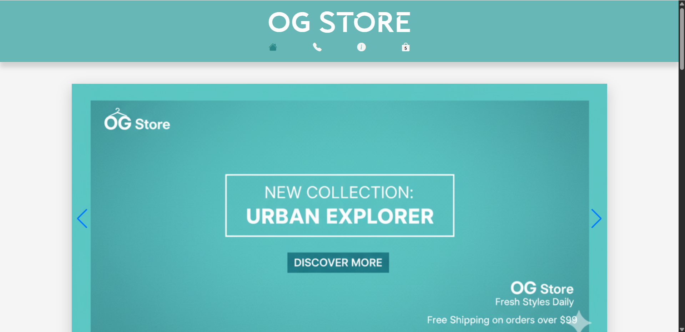
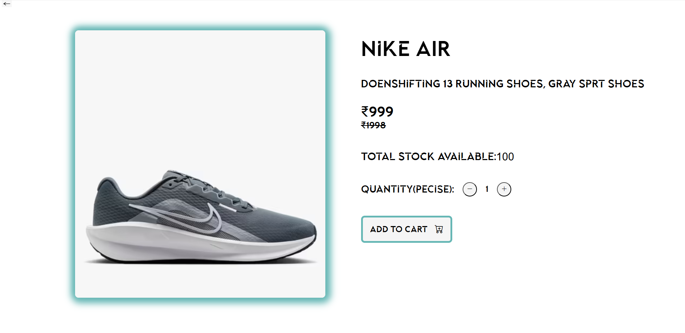
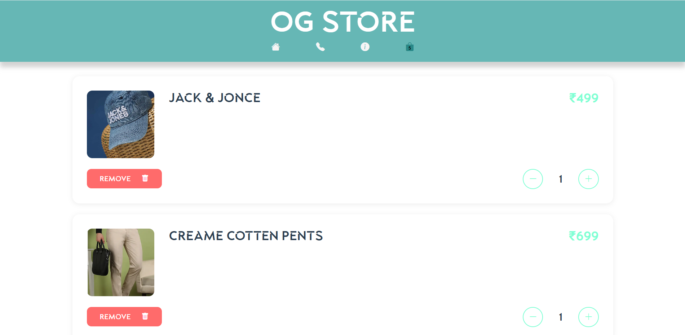

# 🛍️ OG Store - E-Commerce Website

A modern, fully-functional e-commerce website built with HTML, CSS, and Vanilla JavaScript.


## 🌟 Features

- 🎨 **Modern UI Design** - Clean and responsive interface
- 🛒 **Shopping Cart** - Add, remove, and update quantities
- 💾 **Persistent Storage** - Cart data saved in localStorage
- 🎠 **Image Slider** - Product showcase with Swiper.js
- 📱 **Fully Responsive** - Works on all devices
- 🔍 **Product Categories** - Shirts, T-Shirts, Jeans, Caps, Shoes, Accessories
- 📄 **Dynamic Product Pages** - Detailed product views
- 📧 **Contact Page** - Get in touch form
- ℹ️ **About Page** - Company information

## 🚀 Live Demo

[View Live Demo](https://milangadhvi45.github.io/OG-Store-ecommerce-website/)

## 📸 Screenshots

### Home Page



### Product Detail



### Shopping Cart



## 🛠️ Technologies Used

- **HTML5** - Structure
- **CSS3** - Styling and animations
- **JavaScript (ES6)** - Functionality and interactivity
- **Swiper.js** - Image slider
- **Bootstrap Icons** - Icons
- **LocalStorage API** - Data persistence

## 📁 Project Structure

```
og-store/
│
├── index.html (or realmain.html)
├── addcart.html
├── about.html
├── contact.html
│
├── Product Pages/
│   ├── shirt.html
│   ├── T-shirt.html
│   ├── cap.html
│   ├── pents.html
│   ├── shoes.html
│   └── acceris.html
│
├── JavaScript/
│   ├── showproduct.js
│   ├── showcart.js
│   └── sliderscript.js
│
├── CSS/
│   └── style.css
│
├── Data/
│   └── alljson.json
│
└── img/
    └── (all images)
```

## 💻 Installation & Setup

1. **Clone the repository**

   ```bash
   git clone https://github.com/yourusername/og-store.git
   cd og-store
   ```

2. **Open in browser**

   ```bash
   # Simply open index.html in your browser
   # Or use Live Server in VS Code
   ```

3. **No build process required!** - Pure vanilla JavaScript

## 🎯 How to Use

1. **Browse Products** - View different product categories
2. **Product Details** - Click any product to see full details
3. **Add to Cart** - Select quantity and add items to cart
4. **Manage Cart** - Increase/decrease quantities or remove items
5. **Persistent Cart** - Your cart is saved automatically

## 📦 Product Data

Products are stored in `alljson.json` with the following structure:

```json
{
  "id": 1,
  "category": "shirt",
  "name": "Product Name",
  "price": 499.0,
  "stock": 100,
  "description": "Product description",
  "image": "./img/product.jpeg"
}
```

## 🔧 Configuration

### Adding New Products

1. Edit `alljson.json`
2. Add new product object with all required fields
3. Place product image in `img/` folder
4. Refresh the page

### Customizing Colors

Main color: `rgb(102, 183, 181)` - Change in `style.css`

## 🌐 Browser Support

- ✅ Chrome (latest)
- ✅ Brave (latest)
- ✅ Safari (latest)
- ✅ Edge (latest)
- ✅ Opera (latest)

## 📝 Future Enhancements

- [ ] Backend integration
- [ ] User authentication
- [ ] Payment gateway integration
- [ ] Order management system
- [ ] Product search functionality
- [ ] Wishlist feature
- [ ] Product reviews and ratings
- [ ] Email notifications

## 🤝 Contributing

Contributions are welcome! Please feel free to submit a Pull Request.

1. Fork the project
2. Create your feature branch (`git checkout -b feature/AmazingFeature`)
3. Commit your changes (`git commit -m 'Add some AmazingFeature'`)
4. Push to the branch (`git push origin feature/AmazingFeature`)
5. Open a Pull Request

## 👨‍💻 Author

**MIlansinh Gadhvi**

- GitHub: [milangadhvi45](https://github.com/milangadhvi45)
- LinkedIn: [Milansinh Gadhvi](https://www.linkedin.com/in/milansinh-gadhvi-9a7607332?utm_source=share&utm_campaign=share_via&utm_content=profile&utm_medium=android_app)

## 🙏 Acknowledgments

- Swiper.js for the slider
- Bootstrap Icons for icons
- Inspiration from modern e-commerce sites

---

⭐ **Star this repo if you found it helpful!**

Made with ❤️ and JavaScript
